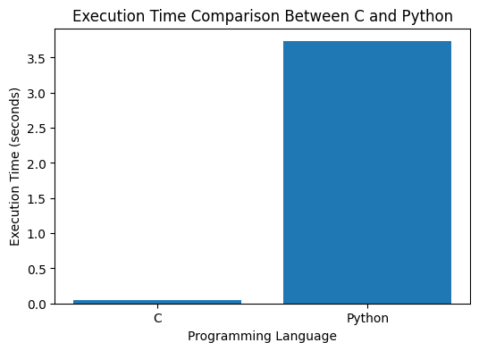

# Comparative Analysis of Execution Efficiency and System Accessibility in Native and Browser-Based Runtime Environments

## Overview
This undergraduate systems research project experimentally compares execution efficiency and filesystem accessibility between native compiled execution environments and browser-based runtime environments.

The study focuses on:
- Native compiled execution using C
- Managed/interpreted execution using Python
- Browser-based JavaScript runtime behavior

The project investigates:
- Runtime abstraction overhead
- Execution efficiency differences
- Browser sandbox restrictions
- Filesystem accessibility
- Security versus performance trade-offs

---

## Abstract
Modern software systems are developed using both native compiled languages and browser-based technologies, each offering different advantages in terms of performance, portability, accessibility, and security.

This research experimentally compares native compiled execution environments represented by the C programming language with managed/browser-based runtime environments represented by Python and JavaScript.

Experimental benchmarks demonstrated that native compiled execution significantly outperformed interpreted execution in computation-intensive workloads. Additionally, filesystem accessibility experiments showed that native execution environments possess deeper operating system interaction capabilities, whereas browser-based environments remain restricted by sandbox security mechanisms and permission-based access models.

The study highlights architectural trade-offs between execution efficiency, abstraction, portability, hardware accessibility, and security in modern computing systems.

---

## Experimental Results

### Execution Benchmark
A computational benchmark involving 100 million iterative summation operations was conducted.

| Language | Execution Time |
|---|---|
| C | 0.046 seconds |
| Python | 3.73 seconds |

Results demonstrated that Python execution required approximately 81 times more execution time compared to native compiled C execution for the same workload.

---

## Benchmark Graph

---

## Filesystem Accessibility Analysis

### Native C
- Direct filesystem access
- File creation support
- Operating system interaction
- Minimal sandbox restrictions
- Low-level runtime accessibility

### Browser JavaScript
- Permission-based access
- Sandboxed environment
- Restricted hardware interaction
- Security isolation mechanisms
- Controlled filesystem access

The experiment demonstrated that browser execution environments intentionally restrict direct system accessibility to improve security and user protection.

---

## Technologies Used
- C (GCC Compiler)
- Python
- JavaScript
- LaTeX (IEEE Format)
- Overleaf
- GitHub

---

## Repository Contents

| File | Description |
|---|---|
| research-paper.pdf | Final IEEE-style research paper |
| benchmark_graph.png | Benchmark comparison graph |
| c_benchmark.c | Native C performance benchmark implementation |
| python_benchmark.py | Python benchmark implementation |
| c_filesystem_access.c | Native C filesystem accessibility experiment |
| README.md | Project overview and research summary |

---

## Research Focus
This project explores architectural trade-offs between:
- Performance
- Portability
- Security
- Runtime abstraction
- System accessibility

The research also investigates how execution environments balance computational efficiency with user protection and system security.

---

## Methodology
The experiments were conducted on a Windows-based system using:
- GCC compiler for C execution
- CPython interpreter for Python execution
- Browser-based JavaScript runtime environments

Equivalent computational workloads were implemented across environments to ensure consistency and fairness in performance comparison.

Filesystem accessibility experiments were conducted to analyze operating system interaction capabilities and browser sandbox restrictions.

---

## Key Findings
- Native compiled execution demonstrated significantly higher computational efficiency.
- Browser-based environments prioritize security isolation over low-level system accessibility.
- Runtime abstraction layers introduce measurable execution overhead.
- Sandbox security mechanisms intentionally restrict unrestricted filesystem access.

---

## Future Work
Future research directions include:
- WebAssembly benchmarking
- Node.js runtime analysis
- Rust performance comparison
- Memory utilization benchmarking
- CPU utilization analysis
- Browser engine optimization analysis
- Hybrid runtime architecture studies

---

## Author
### Prasham Kumbhare
B.Tech Computer Science Engineering  
DY Patil International University  
India

---

## License
This project is intended for academic and educational purposes.
